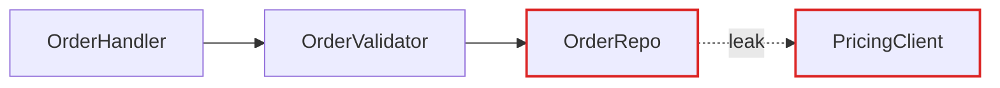
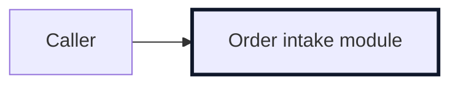

# Report Format

The architectural review is a single Markdown file in the OS temp directory. No HTML. Before/after structure is shown
with Mermaid fenced blocks, which render in GitHub and most Markdown viewers and stay readable as plain text in source.

Apply the writing voice: plain, declarative, no em-dashes, no flavor. The diagrams carry the structure, the prose stays
sparse and uses the glossary terms from [language.md](language.md) without ceremony.

## File structure

```markdown
# Architecture review: <project>

**Date:** <YYYY-MM-DD>

Legend: solid edge = call, dashed edge = seam, red node = leakage, bold node = deep module.

## Candidates

<one section per candidate>

## Top recommendation

<which candidate to tackle first, and one sentence on why, with a link to its section>
```

No introduction paragraph. Go straight into the candidates.

## Candidate section

Each candidate is one `##` section under Candidates. Keep it tight:

```markdown
### <short title naming the deepening, e.g. Collapse the Order intake pipeline>

**Strength:** Strong | Worth exploring | Speculative
**Dependency category:** in-process | local-substitutable | ports & adapters | mock

**Files:**

- `path/to/module_a.py`
- `path/to/module_b.py`

**Before / After**

<two Mermaid blocks, see patterns below>

**Problem:** one sentence. What hurts.

**Solution:** one sentence. What changes.

**Wins:**

- <gain in glossary terms, six words or fewer>
- <gain in glossary terms, six words or fewer>
```

If a candidate contradicts a recorded decision in the wiki, add one line: `**Note:** contradicts <decision> in the
wiki, but worth reopening because <reason>.` Only surface the conflict when the friction is real enough to warrant
revisiting the decision. Don't list every theoretical refactor a decision forbids.

If the diagram needs a paragraph to be understood, redraw the diagram.

## Mermaid patterns

Pick the pattern that fits the candidate. Vary them across candidates.

### Call flow (the workhorse for dependencies)

Use when the point is "X calls Y calls Z, and look at the mess." Colour leakage edges red and the deep module bold.

````markdown
**Before**



**After**


````

### Sequence (good for round-trip reduction)

Use a `sequenceDiagram` when the win is "before: six round-trips, after: one."

### Mass contrast (good for interface as wide as implementation)

Show interface surface vs implementation size. Before: the interface node is nearly as prominent as the implementation.
After: a small interface node feeding one bold deep module.

## Closing the review

End with the **Top recommendation** section: which candidate you'd tackle first, one sentence on why, and a Markdown
link to its section.

## Tone

Plain and concise. The architectural nouns and verbs come straight from [language.md](language.md).

**Use exactly:** module, interface, implementation, depth, deep, shallow, seam, adapter, leverage, locality.

**Never substitute:** component, service, unit (for module); API, signature (for interface); boundary (for seam);
layer, wrapper (for module, when you mean module).

**Wins bullets** name the gain in glossary terms: _"locality: bugs concentrate in one module"_, _"leverage: one
interface, N call sites"_, _"interface shrinks, implementation absorbs the wrappers"_. Don't write _"easier to
maintain"_ or _"cleaner code"_. Those terms aren't in the glossary.

No hedging, no "it's worth noting that." If a sentence could be a bullet, make it a bullet. If a bullet could be cut,
cut it. If a term isn't in [language.md](language.md), reach for one that is before inventing a new one.
